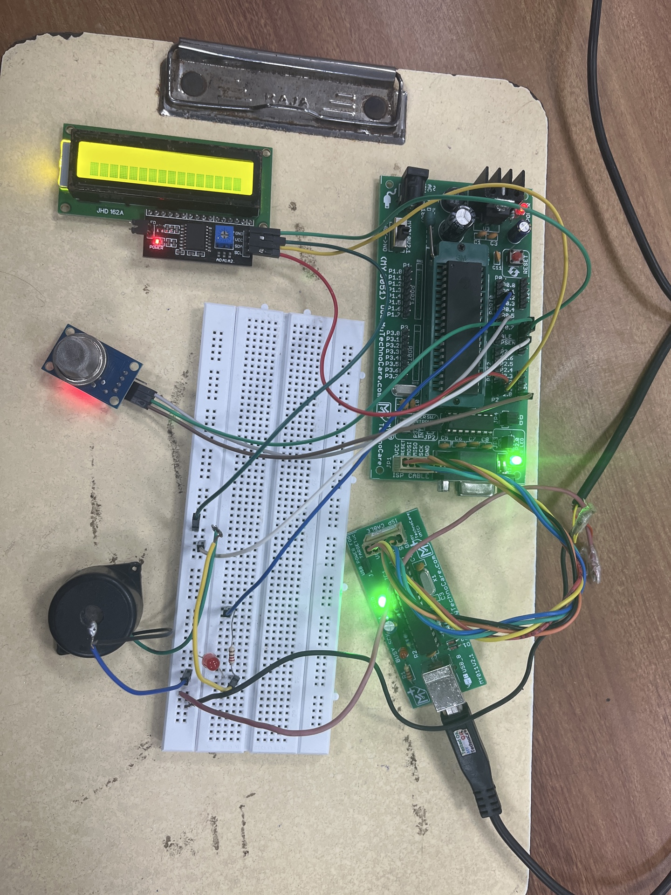

# 🔥 Gas Leakage Detection & Automatic Alert System (8051)

A real-time embedded system that monitors for harmful gas leaks using an MQ-6 sensor and alerts users via LED, buzzer, and LCD. Developed using the 8051 microcontroller with I2C-enabled LCD display.

---

## 🛠 Technologies Used

- **Microcontroller:** AT89C51 (8051 Architecture)
- **Gas Sensor:** MQ-6
- **Display:** 16x2 LCD with I2C Interface
- **Programming Language:** Embedded C
- **IDE:** Keil µVision
- **Programmer:** USB to Serial
- **Simulator/Toolchain:** Proteus / Real-time prototyping

---

## 🔧 Hardware Components

- MQ-6 Gas Sensor  
- AT89C51 / 8051 Microcontroller  
- LED & Buzzer  
- 16x2 LCD Display (with I2C Module)  
- Resistors (220 ohm)  
- Breadboard and Jumper Wires  
- Power Supply (5V/12V)  
- USB to Serial Programmer

---

## 💡 Features

- 🚨 **Gas Leakage Detection:** Continuous monitoring with real-time response
- 🔊 **Alerts:** Audible buzzer + blinking LED upon gas detection
- 📺 **LCD Output:** Clear display of status messages
  - `SAFE ENVIRONMENT` (no gas)
  - `**GAS DETECTED**` (leak present)
- 🔁 **Debounced Signals:** To avoid false triggering
- ⚡ **I2C Communication:** Efficient interface with LCD module
- 🔧 **Modular Design:** Ready for future upgrades like GSM alerts or exhaust control

---

## 📂 File Structure

```
Gas_Leakage_Alert_System_8051/
├── MP&MC_PROJECT.c                # Main embedded C code
├── MP & MC PROJECT_FINAL.pdf     # Documentation with circuit + flow
├── Image.jpeg / Image.png        # Real circuit images
└── README.md
```


---

## 🔄 Code Overview

```c
if (gas_sensor == 0) {
    led = 1; buzzer = 1;
    lcd_send_str("**GAS DETECTED**");
} else {
    led = 0; buzzer = 0;
    lcd_send_str("SAFE ENVIRONMENT");
}
```


Uses reg51.h and I2C-based LCD functions
Implements custom i2c_start(), i2c_write(), lcd_send_cmd() functions
Displays messages based on MQ-6 digital output


Screenshots
## 📸 Screenshots

| Final Breadboard Circuit | Component Layout & Sensor Connections |
|--------------------------|----------------------------------------|
|  |  |


🧪 Challenges Faced
Calibrating MQ-6 for reliable detection
Stable I2C communication with LCD
Signal debouncing to prevent false positives
Power supply noise filtering
Managing complex breadboard connections


👨‍💻 Team Members
Gugulothu Sai Kiran – [IIIT Sri City]
Embadi Akash
Bokara Neelavardhan

🧠 Learnings
Embedded C programming for real-time hardware
I2C LCD integration and communication protocols
System stability design under sensor-triggered inputs
Debugging embedded hardware setups


📌 Applications
Residential homes 🏠
Gas stations ⛽
Industrial plants 🏭
Chemistry labs 🧪


📜 License
Open-source for academic and educational use. Attribution appreciated.
